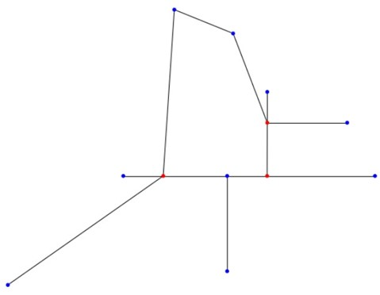
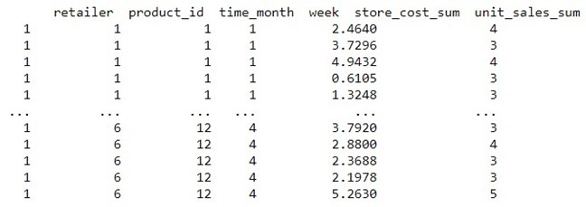
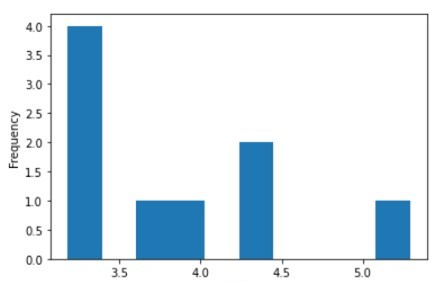
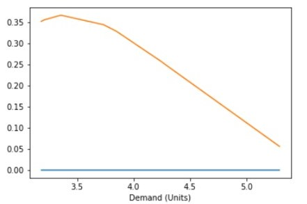
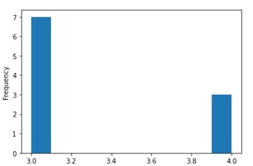
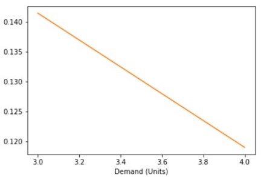
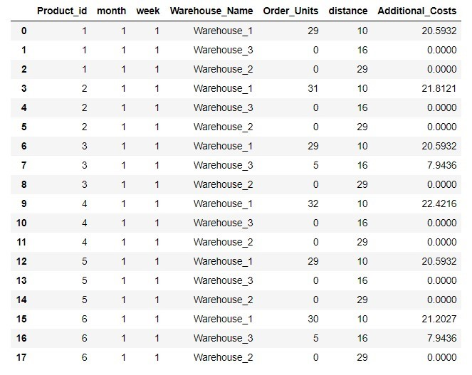

PROJECT REPORT ON

SUPPLY CHAIN OPTIMIZATION

modeled on the classic newsvendor model

(for multiple commodities).

By

ACHYUT DAVE

 

UNIVERSITY OF COLORADO BOULDER

DATED: 12/07	/2020.
 
Table Of Contents

Need for Supply Chain Optimization.

Hyperparameters used / assumptions made during the project.

Information flows in Supply Chain.

What is bottom-up approach to Supply Chain Management?

How do we study ‘The Map’?

How do we study the historic data and the latest data?

Does the distribution of customer demand change?

How can the retailers benefit?

Does changing ‘The Resolution’ have any effect? More importantly when does ‘The Resolution’ change make sense?

Can evaluation help? Assuming evaluation is followed by ‘The Recalibration’.

References

SUPPLY CHAIN OPTIMIZATION

Need for Supply Chain Optimization:

In any type of multicommodity flow problem, we see that by circumspectly creating a distributed or multiagent planning system, outlining the abilities of  agents and understanding the system’s compatibility with other elements of the economy; we can attain a variety of fascinating behaviors.[1] Inspecting the concept of scarcity is the fundamental problem, which can be studied at an advanced level separately, at the heart of demand generation.

With respect to a programming paradigm, we need an infrastructure for building market-based systems to obtain a set of prices that balance supply and demand of all goods, taking general equilibrium as the gold standard solution. Algorithms can be asynchronous and decentralized; and I present some experimental results of one such algorithm.

General Equilibrium Models (GEMs) are used for many purposes in the development of wide range of policy questions and areas, and quantifying their potential effects; for several reasons, including to better understand the combination of market-based systems.[2] A lot of researchers have analyzed the newsvendor problem and I try to integrate one extension, which could have wide ranging implications for managing inventory decisions for organizations. This is because the usual approach to analyze the problem is based on successful assumptions / predictions of future demand, and evaluation of the model from an expected target demand / sales perspective is vital.

Unless the retailers are very sure, most of the demand distributions are unknown. And considering additional freight costs, at what price to sell a product is also an important question from an economic point of view. Among these questions and many more, important from all perspectives, we study how to perform supply chain optimization under the mild assumptions of the demand and cost functions.

Fig. 1: Reality of next wave of growth in industries. [Source: https://www.mckinsey.com/] 

Hyperparameters used / assumptions made during the project:

I have studied the supply chain optimization from a database called foodmart_mysql[3], where I divided up different tables to form train and test dataset.

I have assumed six products, sold to consumers / customers at nine retailers and supplied by three warehouses. All retailers can place orders to the warehouses once a week, as the demand data in the foodmart_mysql database can change weekly at the earliest.

One week in this case is ‘The Resolution’.

To make the problem statement realistic, I have copied the geographical graph of Costco retailers and warehouses in the Dallas-Fort Worth area in Texas, USA.

Further assumptions include setting down the inventory size of retailers as well as the warehouses.

For making sensible compatibility with real world[4], I try to abide by minimum and maximum orders possible to any retailer from any warehouse.

The final assumption is that the additional freight costs are dependent on factors such as distance, order size and the size of warehouse.

 
Fig. 2: Graphical Representation of Costco Retailers and Warehouse Map. 

Information flows in Supply Chain :

Information flows in the supply chain are bidirectional.

From the producer’s side to the customer side, the information flow mainly comprises of production rates and inventory supply details.[5]

In the other direction, the main information is regarding the supply requirements, whereas other information may include demand, selling price, discounts, etc.

  
Fig. 3:Synchronization in Supply Chain. [Source: https://sourcingjournal.com/] 

What is bottom-up approach to Supply Chain Management? :

Since most of the “optimization” in Supply Chain Management is directed towards maximizing profits, the key figure in the supply chain remains the consumer / customer.[6]

Giving higher weightage to the information from the customer side is always beneficial and generally called the “Operational Supply Chain Management”; as the variables addressed at this level, such as, demand, selling price, discounts, etc.; have to be optimized most frequently.[7]

The trends and variation of demands or localized changes in the supply chain can be initially recognized at the local retailer stores, and thus information processing at that level can be highly valuable.

 
Fig. 4: Modern Supply Chain Management. [Source: https://hbr.org/] 

How do we study ‘The Map’? :

This graphical representation of Costco retailers and warehouse map is referred to as ‘The Map’.

 
Fig. 5: ‘The Map’.

This map represents warehouses as the red nodes and retailers as the blue nodes.

As can be easily manifested from the graph, this map represents one urban area (where the density of warehouses and retailers are higher), and one suburban area.

Logically I have simulated the system in a way that the suburban warehouse has a larger inventory size (as it is cheaper to have huge warehouses in the suburbs).

How do we study the historic data and the latest data? :

Historic data has information such as month, week, etc. to divide the yearly data into smaller fragments.

Each retailer has its own version of historic data.

Each retailer can add its latest data that can be compared to find differences and similarities with the historic data.

 
Fig. 6: A snip of historic data of Retailer_1.
 

Does the distribution of customer demand change? :

Based in historical data, actual demand of the last week, and the predicted demand of the upcoming week, I try to predict the distribution of the demand for the upcoming week.

Fig. 7.a: Histogram of predicted demand distribution

 
Fig. 7.b: Probability Distribution Function of predicted demand

This is possible for seven different types of demand distributions.

 
Fig. 8.a: Histogram of predicted demand distribution.

 
Fig. 8.b: : Probability Distribution Function of predicted demand

This is further used to predict the appropriate selling price after taking into account additional costs.

The Stochastic Gradient Descent (SGD) mathematical update equation is as follows:

yi = yi + αi F(xi, targeti)

where
             yi = price of i

             xi = demand of i
    
    targeti = a sample from distribution with mean = supply of i * τ
    
             αi = change constant of i, directly proportional to profit margin of i
             
              τ = time between updates / total time
  
  F(xi, targeti) = ∇ (xi - targeti)

How can the retailers benefit? :

Based on geographic limitations, minimum and maximum order limits, predicted demand and retailer side inventory limitations; order predictions like this one can be generated which aim at minimizing additional freight costs for the retailer.

 
Fig. 9: Order predictions for Retailer_2.

Does changing ‘The Resolution’ have any effect? More importantly when does ‘The Resolution’ change make sense? :

All retailers can place orders to the warehouses once a week, as the demand data in the foodmart_mysql database can change weekly at the earliest.

One week in this case is ‘The Resolution’.

If a retailer system can provide daily updates on the demand, then it’s possible to change ‘The Resolution’ to one day.

Can evaluation help? Assuming evaluation is followed by ‘The Recalibration’. :

It is a viable future scope.

My perfect plan for this product could be to let a retailer use this system for six months for free on his actual data, and give predictions based on ‘The Resolution’.

Then I will ask the retailer to rate my prediction and correct it, if needed. In this way I can easily judge by how much is my system deviating, and in what direction.

This will be used to alter, some functions, such as, additional cost estimation, or hyperparameters in the system.

This process is referred to as ‘The Recalibration’.
 

References:

1.	Michael Wellman, “A Market-Oriented Programming Environment and its Application to Distributed Multicommodity Flow Problems.”, 1993, Journal of Artificial Intelligence Research.

2.	Romulo Chumacero and Klaus Schmidt-Hebbel, “General Equilibrium Models: An Overview”, 2005, Central Bank of Chile.

3.	http://pentaho.dlpage.phi-integration.com/mondrian/mysql-foodmart-database

4.	Xiaolin Xu, Xiaoqiang Cai, Youhua Chen, “Unimodality of Price-Setting Newsvendor’s Objective Function with Multiplicative Demand And Its Applications”, 2011, International Journal of Production Economics.

5.	Afshin Oroojlooyja, Lawrence V. Snyder, Martin Takác , “Applying Deep Learning to the Newsvendor Problem”, 2018 IISE Transactions.

6.	Kenneth J. Arrow, Theodore Harris, Kacob Marschak, “Optimal Inventory Policy”, 1951, Econometrica, Vol 19.

7.	F. Y. Edgeworth, “Edgeworth on Banking”, 1888.

